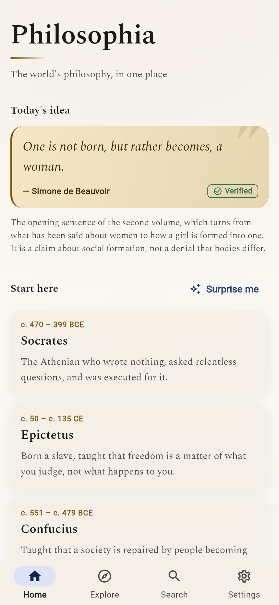
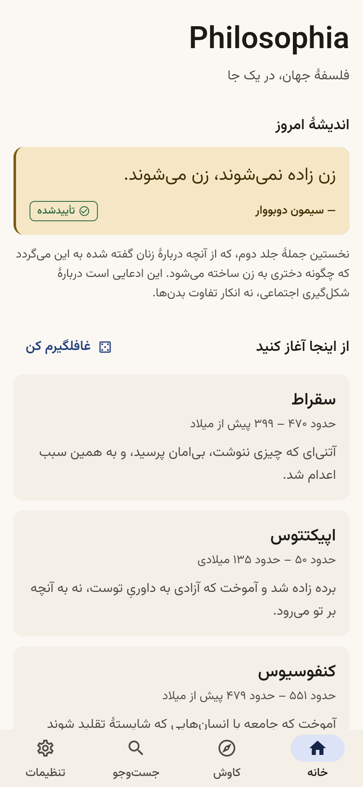
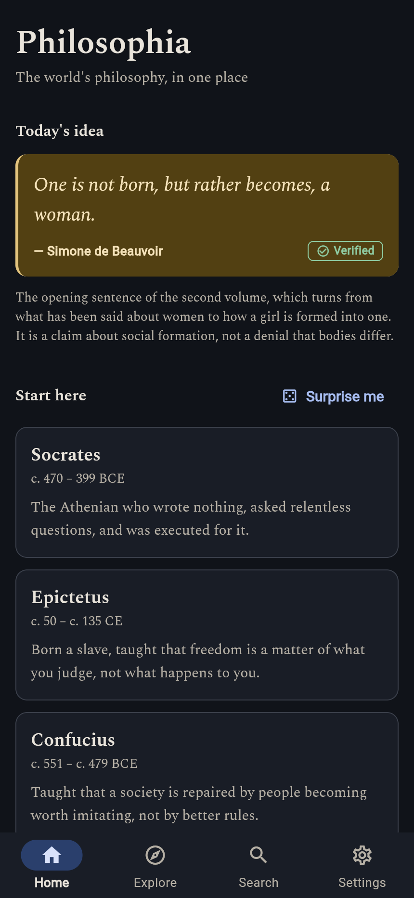
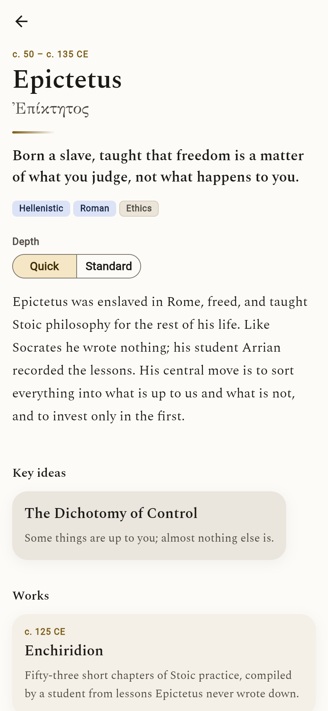
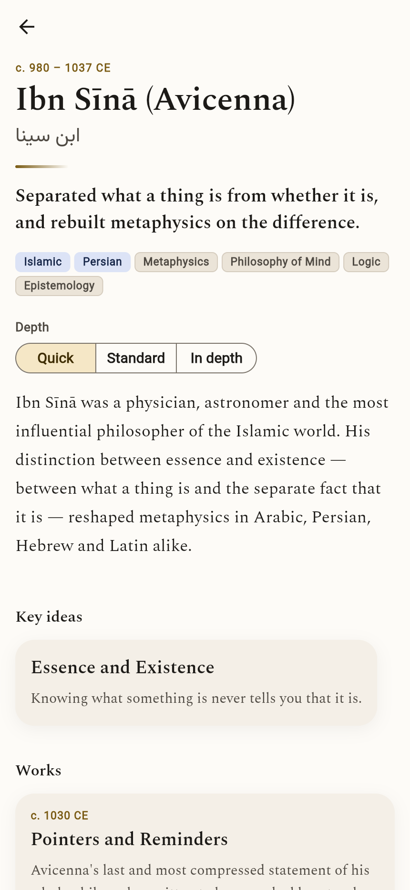

# Philosophia

A bilingual (فارسی / English) reference, library and learning platform for world
philosophy, built with Flutter.

> **Status: early foundation.** The architecture, design system, content
> pipeline and search engine are built, tested and verified. The corpus is small
> and most of the planned product surface does not exist yet. See
> [`docs/CHECKPOINT.md`](docs/CHECKPOINT.md) for an honest, evidence-backed
> account of what is and is not done.

## What is actually here

| Area | State |
| --- | --- |
| Design system, light + dark themes | Built, WCAG AA verified by test |
| Motion system, reduced-motion honoured | Built, 14 tests |
| Script coverage: Latin, Arabic, polytonic Greek | Built, 12 tests |
| Bilingual architecture (fa/en, RTL/LTR) | Built, verified end to end |
| Domain model and content pipeline | Built, integrity-checked by test |
| Search (cross-script, fuzzy, Persian-aware) | Built, 26 tests |
| Home, Explore, Search, Settings, Article screens | Built |
| Corpus | 14 philosophers, 12 concepts, 14 works, 6 schools, 10 quotations, 2 arguments, 24 sources |
| Reader, learning platform, quizzes, graph view, AI assistant | **Not started** |

## Running it

The project targets Flutter 3.47 / Dart 3.13.

```bash
flutter pub get
flutter gen-l10n     # generated localisations are not committed
flutter run          # or: flutter build web --release
```

## Verifying it

```bash
flutter analyze                 # must report no issues
flutter test                    # 164 tests
flutter build web --release     # must succeed
```

The tests are not decoration. Five of them are load-bearing:

- `test/core/design/contrast_test.dart` fails the build if any colour pair in
  either theme drops below WCAG AA.
- `test/data/content_integrity_test.dart` loads the corpus that actually ships
  and fails on any dangling cross-reference, any untranslated entry, and any
  quotation whose attribution is not supported by what the content policy
  requires.
- `test/app/app_smoke_test.dart` boots the real app and drives it through
  navigation in both languages and both themes.
- `test/core/design/motion_test.dart` fails if any animated primitive stops
  honouring the platform's reduced-motion setting — and also if it stops
  animating when motion is allowed, so disabling everything is not a way to pass.
- `test/core/design/typography_test.dart` fails if any text style loses its
  font-fallback chain, which is how Greek and Arabic names silently turn into
  empty boxes.

## Layout

```
lib/
  app/          Application shell: providers, router, settings
  core/         Cross-cutting: design system, search, formatting, errors
  data/         Content loading, parsing and the in-memory knowledge base
  domain/       Entities and value objects; no Flutter dependency
  features/     One directory per screen area
  l10n/         ARB files (generated output is gitignored)
assets/
  content/      The corpus, as JSON
  fonts/        Vazirmatn (Persian) and Spectral (English), both SIL OFL 1.1
docs/           Architecture decisions, content policy, checkpoint
```

## Documentation

- [`docs/ARCHITECTURE.md`](docs/ARCHITECTURE.md) — structure and the decisions
  behind it, with the trade-offs stated
- [`docs/CONTENT_POLICY.md`](docs/CONTENT_POLICY.md) — the editorial rules,
  including the ones enforced by tests
- [`docs/CHECKPOINT.md`](docs/CHECKPOINT.md) — verified project state and the
  next steps

## Licences

The application code is in this repository. Bundled third-party assets:

- **Vazirmatn** by Saber Rastikerdar — SIL Open Font License 1.1 (Arabic script)
- **Spectral** by Production Type — SIL Open Font License 1.1 (Latin reading)
- **GFS Didot** by the Greek Font Society — SIL Open Font License 1.1
  (polytonic Greek)

All three licences are bundled as assets and registered with Flutter's licence
registry, so they appear in the app's own About screen.

Philosophical content is written for this project from primary texts and
academic reference works. Sources are recorded per claim; see the content
policy for the rules governing them.

## Screenshots

Captured from the release web build running in Chromium, with no JavaScript
errors. Left to right: English light, Persian light (fully right-to-left,
Persian digits, Vazirmatn), English dark.

| English | فارسی | Dark |
| --- | --- | --- |
|  |  |  |

An article, and the same layout carrying three scripts at once — the Greek is
polytonic and the Arabic runs right-to-left inside an English page:

| Article | Mixed scripts |
| --- | --- |
|  |  |
